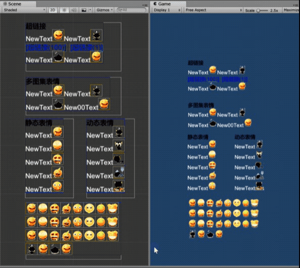
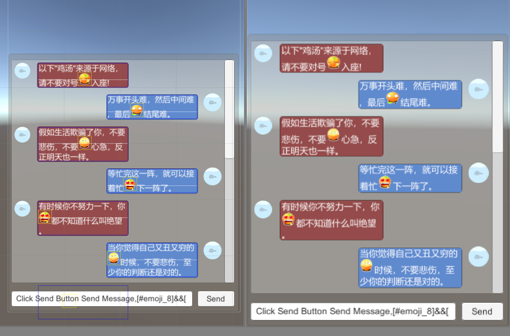

### **新增功能**  
1. 使用shader渲染表情动画，取消了在update中循环更新模型数据  
2. 支持在编辑器中直接预览(支持不完全)  
3. 在编辑中增加了线框辅助调试  
4. 利用了对象池对部分比较明显的GC问题进行了优化  
5. 重新更换了坐标系转换的计算，更好的支持Canvas Render Mode的切换  
6. 精简整理了代码  
7. 简单优化了编辑器的操作  

### **强行解释**  
1. 利用shader渲染表情动画，可以更好的利用设备的性能，但是一开始并没有很好的思路，后面发现UGUI的Mesh支持uv0-uv3，天真的以为可以利用多层uv存下多个数据，后面经过调试发现uv0-uv4的值，完全一样，意思就是unity canvasrender目前的设计，为了优化性能,不支持uv1-uv3,并不是bug,所以没法存多套uv。[https://issuetracker.unity3d.com/issues/canvasrenderer-dot-setmesh-does-not-seem-to-support-more-than-one-uv-set](https://issuetracker.unity3d.com/issues/canvasrenderer-dot-setmesh-does-not-seem-to-support-more-than-one-uv-set)，也不知道unity官方以后会不会更新，所以还是目前采用了老方法，uv移动来做动画。  
2. 动态和静态表情，在配置文件上勾选`Static`即可，现在的动态表情的其他信息还没有集成在`SpriteAsset`里面，需要在`SpriteGraphic`上更改一下`CellAmount`和`Speed`,`CellAmount`是当前一行精灵的个数。 
3. 之前也提过，写这个插件并没有实际的使用机会，难免考虑不周，收集的意见，大部分都有自己的想法，比较杂乱，所以建议如果能直接使用，那是最好的。如果跟自己的需求有偏差，希望能作个参考，自己更改，欢迎提交pr。然后我会再尽力写成通用的。  
4. 提交的pr，改动小，我会检查合并，如果改动太大，我会单独新建分支留存，以便有需要的人查看。  
5. 其实`SpriteAsset`的Sprite是没有作用的，目前是为了方便制作预览`SpriteAsset`,后面可能会再更新一键生成配置文件，直接动态划分表情信息

---  

### **功能介绍**  
1. 此插件是基于UGUI所做的图文混排功能，常用于聊天系统的表情嵌入;  
2. 可支持静/动态表情,支持超链接;  
3. 实现原理，是基于UGUI的富文本，使用quad标签进行占位;  
4. 使用了Asset文件来存储本地的表情信息;  
5. Text根据正则表达式，解析文本，读取相应的表情信息，并在相应位置绘制相应的Sprite;  
6. 正则表达式为[图集ID#表情标签]，图集ID为-ID时，表示此标签为超链接，如-1,图集ID为 0时，可省略不写;  
7. 有同学提过想支持移动端系统自带的表情，我这里只提一个简单的实现思路，集成不看自己的实际需求了，自己备好系统表情的图集，再解析一下当前系统输入表情的正则表达式，然后跟插件一样的嵌入到Text中（这算是正常的集成实现思路么？）;  
---
### **使用步骤**  
1. 选择一张表情图片，导入在unity里，并设置为`Texture Type`为`Sprite(2D and UI)`，需要点击`Sprite Editor`手动选取表情;  
2. 右键选择图片，点击`Create/Sprite Asset`,创建图集资源;  
3. 针对Asset文件，可以设置图集的ID、是否为静态表情，和标签等属性，同为一个动态表情的Sprite应该设置为同一个标签;  
4. 点击菜单栏`GameObject/UI/Textline`,即可创建UI;  
5. 在`SpriteGraphic`上更改一下`CellAmount`和`Speed`,`CellAmount`是当前一行精灵的个数;  
6. 在InlineText组件中输入`[#emoji_0]`,即可显示表情;  
---  
### **截图展示**  
  
  
   
---
